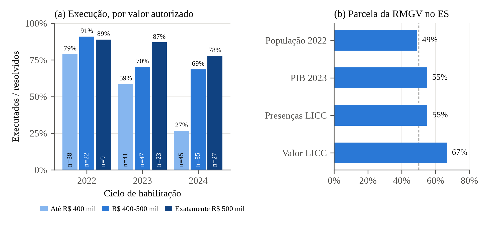

**Resumo.** A Lei de Incentivo à Cultura Capixaba (LICC) permite que contribuintes do ICMS destinem a projetos culturais habilitados pela Secretaria da Cultura (SECULT) valores que recuperam integralmente como crédito presumido do imposto. Este artigo avalia o desenho da política como ela está e propõe uma avaliação de impacto. Com os anexos oficiais de 463 projetos habilitados entre 2022 e 2026 e da captação de 2025, mostramos que a política não declara problema, metas nem indicadores; que a demanda habilitada supera o teto anual de renúncia e o racionamento é feito pelas empresas patrocinadoras; que a captação favorece projetos que pedem o teto por projeto e proponentes recorrentes; que o valor habilitado se concentra na Região Metropolitana da Grande Vitória, onde fica 67% do valor atribuível a um município; e que duas empresas respondem por metade da renúncia de 2025. Propomos um desenho de diferenças em diferenças com adoção escalonada, no nível do proponente, que compara projetos habilitados em 2022-2024 que captaram com os que não captaram, e mostramos que o universo disponível detecta efeitos a partir de 0,25 a 0,45 desvio-padrão.

**Palavras-chave:** incentivo fiscal à cultura; gasto tributário; avaliação de desenho; teoria da mudança; diferenças em diferenças.

# 1 Introdução

Em 2021, o Espírito Santo criou um mecanismo estadual de incentivo fiscal à cultura, descrito pela própria Secretaria da Cultura como iniciativa inédita no estado (SECULT, [202-]). A Lei estadual nº 11.246/2021 incluiu na lei do ICMS um crédito presumido igual ao valor que o contribuinte destina a projetos culturais credenciados pela SECULT, com efeitos a partir de 2022 (ESPÍRITO SANTO, 2021a). A Lei de Incentivo à Cultura Capixaba, como o mecanismo passou a ser chamado no regulamento (ESPÍRITO SANTO, 2021b), cresceu depressa: o teto anual de renúncia passou de R\$ 10 milhões em 2022 para R\$ 31 milhões em 2026, e 463 projetos foram habilitados a captar R\$ 184 milhões nos cinco ciclos (459 com valor publicado). Em 2025, 63 projetos captaram exatamente R\$ 25.000.000,00, o teto do ano.[^repo]

[^repo]: Todos os números deste artigo vêm dos anexos oficiais da SECULT ("Lista de projetos habilitados" e "Recurso financeiro captado - 2025"), de bases públicas do IBGE, do Tesouro Nacional (SICONFI) e do Ministério da Cultura (SALIC). A lista de habilitados foi transcrita na versão disponível em 3 set. 2026 (repositório licc.gov); a SECULT atualizou o arquivo em 10 set. 2026, e os status publicados podem ter mudado desde então. Dados, scripts e tabelas estão em <https://github.com/fcarva/aval-pol>, nos diretórios `dados/`, `analise/` e `analise/tabelas/`.

Nenhuma das normas da LICC diz qual problema ela enfrenta. O diagnóstico precisa ser reconstruído. O setor cultural capixaba é pequeno para o tamanho da economia do estado: em 2024, ocupava 4,2% dos trabalhadores do ES, contra 5,8% no país, a 18ª participação entre as 27 unidades da federação (IBGE, 2025). A desigualdade relevante, porém, é interna. Em 2021, 95% da população da Região Metropolitana da Grande Vitória (RMGV) vivia em município com cinema, contra 34% da população do interior; metade dos municípios do interior não tinha fundo municipal de cultura e só 16% tinham plano municipal (IBGE, 2022). Propomos, por isso, formular o problema como uma carência: **a baixa e desigual capacidade de financiar a produção e a oferta cultural fora do circuito já consolidado**, com causas na restrição de financiamento de pequenos produtores, na concentração de equipamentos e de capacidade institucional e na dependência de poucos financiadores.

Avaliar a LICC se justifica por três razões. Primeiro, é gasto público sem passar pelo orçamento: o teto de renúncia equivale a 14% a 21% do gasto estadual direto na função cultura em 2022-2025 (Tabela 1). Segundo, quem decide o destino do recurso é a empresa patrocinadora, e não o Estado, o que torna a política exposta às críticas de concentração e de lógica de marketing feitas à Lei Rouanet (SILVA, 2017; DEKKER; RODRIGUES, 2019). Terceiro, a política é nova, muda de regra a cada ano e nunca foi avaliada: não localizamos nenhum estudo sobre ela.

O artigo tem dois objetivos, definidos pela disciplina: avaliar o desenho da LICC **como ela está**, sem propor redesenho do mecanismo, e estruturar uma avaliação de impacto, com desenho amostral, fontes de dados e cálculo de poder. A seção 2 caracteriza a política; a seção 3 revisa a literatura; a seção 4 apresenta a teoria da mudança e avalia o desenho com os dados administrativos; a seção 5 propõe a avaliação de impacto; a seção 6 conclui.

# 2 Caracterização da política

A LICC é um **gasto tributário com escolha privada**. O proponente, pessoa jurídica com finalidade cultural e sede no estado há dois anos, inscreve o projeto na SECULT. Se o projeto for habilitado, o proponente procura uma empresa contribuinte do ICMS que aceite patrocinar. A empresa deposita o valor numa conta do projeto e compensa até 100% dele com o ICMS devido (ESPÍRITO SANTO, 2021b, art. 10). Não há contrapartida financeira da empresa. O Quadro 1 resume as regras.

**Quadro 1 – Elementos do desenho da LICC**

| Elemento | Regra vigente | Norma |
|--------------|----------------------------------|------------------|
| Benefício ao patrocinador | Crédito presumido de até 100% do patrocínio, compensado com o ICMS a recolher | Lei 7.000/2001, art. 5º-B, IX; Dec. 5.035-R/2021, art. 10 |
| Teto anual | Fixado pela SEFAZ até 31/01, ampliável no exercício, limitado a 2% do ICMS estadual do ano anterior: R\$ 10 mi (2022), 15 mi (2023), 25 mi (2024 e 2025), 31 mi (2026) | Dec. 5.035-R/2021, art. 4º; Dec. 5.210-R/2022; portarias SEFAZ |
| Limite por patrocinador | 20%, 15%, 10% ou 5% do ICMS recolhido no ano anterior, conforme a faixa de imposto | Dec. 5.035-R/2021, art. 10, § 1º |
| Proponentes | Pessoa jurídica com finalidade cultural e sede no ES há 2 anos; até 3 inscrições por ano | Dec. 5.035-R/2021, art. 5º; IN 001/2025, art. 13 |
| Limite por projeto | R\$ 500 mil; R\$ 300 mil em primeira edição; R\$ 1 milhão para patrimônio e longa-metragem | IN 001/2025, arts. 14-16 |
| Seleção | Parecer técnico e deliberação de comissão paritária (CAP) sobre nove critérios qualitativos, sem pontuação prevista em norma; resultado binário | Dec. 5.035-R/2021, art. 14; IN 001/2025, arts. 37-42 |
| Alocação entre habilitados | Pela empresa patrocinadora; reservas do teto: 30% para eventos com mais de 10 anos, 10% para planos plurianuais, 10% para projetos fora da RMGV, 50% para os demais | IN 001/2025, art. 18 |
| Contrapartidas | Ao menos cinco, de um cardápio de acesso, gratuidade, descentralização, ações afirmativas e acessibilidade | IN 001/2025, arts. 35-36 |
| Controle | Extrato no Diário Oficial a cada repasse; prestação de contas focada no cumprimento do objeto; fiscalização presencial por amostragem | Dec. 5.035-R/2021, arts. 17-19 |

Fonte: elaboração própria a partir das normas citadas (ESPÍRITO SANTO, 2021a; 2021b; SECULT, 2025a; 2026a).

Três características do arranjo pesam na avaliação. A primeira é a **delegação da escolha**: o Estado define quem pode receber; a empresa define quem recebe. A segunda é a **instabilidade**: a SECULT edita uma instrução normativa por ano e, alegando esgotamento do teto, fechou as inscrições no meio de 2024 e alterou o fluxo de habilitação no meio de 2025 (SECULT, 2024; 2025b). Na instrução de 2025, o parecer favorável gerava um certificado de aptidão à captação, válido por um ano, com o qual o proponente procurava patrocinador; ao reunir termos de compromisso de ao menos 35% do valor, o projeto ia à comissão e seguia captando até o fim do prazo do certificado (SECULT, 2025a, arts. 41-45). Desde maio de 2025, o proponente tem 120 dias para apresentar uma carta de intenção de patrocínio, contados da comunicação da SECULT, sob pena de arquivamento (SECULT, 2025b). A terceira é a **pouca informação publicada**: os anexos não trazem o CNPJ do proponente, a linha de financiamento, a sede, o rateio entre municípios, os inscritos não habilitados nem qualquer indicador de resultado.

# 3 Breve revisão da literatura

**Despesa tributária com decisão privada.** A literatura de economia da cultura trata o incentivo fiscal como um subsídio em que o contribuinte decide a alocação e o Tesouro paga a conta. Feld, O'Hare e Schuster (1983) chamaram os contribuintes americanos de "mecenas apesar de si mesmos"; Schuster (2006) sistematiza os instrumentos; Brooks (2004) mostra que, nos Estados Unidos, cada dólar de apoio federal direto às artes vem acompanhado de cerca de 14 dólares de renúncia, que servem a públicos diferentes. A justificativa econômica usual é de falha de mercado: a produtividade estagnada das artes ao vivo (BAUMOL; BOWEN, 1966) e o caráter de bem público ou meritório da cultura (THROSBY, 1994). O crédito de 100% da LICC ocupa o extremo desse espectro: o doador não tem custo líquido algum.

**A experiência brasileira com a Lei Rouanet.** A LICC reproduz o núcleo do mecenato federal, que acumula três décadas de crítica. Os estudos documentam concentração regional no Sudeste, sobretudo em São Paulo e no Rio de Janeiro (SILVA, 2017; TEIXEIRA; XAVIER; FARIA, 2024), maior que a do PIB (GUIMARÃES, 2020), concentração persistente de patrocinadores e proponentes (COSTA; MEDEIROS; BUCCO, 2017) e a formação de um "mercado de patrocínios" com intermediários e departamentos de marketing (BELEM; DONADONE, 2013). Dekker e Rodrigues (2019) concluem que a lei beneficiou sobretudo projetos já bem-sucedidos e que não fica claro qual falha de mercado ela corrige. O Tribunal de Contas da União recomendou que as ações financiadas por renúncias tenham objetivos, indicadores e metas (BRASIL, 2014) e determinou ao Ministério da Cultura que não autorizasse a captação por projetos com forte potencial lucrativo ou capacidade de atrair investimento privado suficiente (BRASIL, 2016). Silva (2017) oferece o contraponto: a concentração convive com uma cauda longa de projetos pequenos, e faltam estudos sobre o efeito no acesso da população. Os motivos das empresas vão além do mérito cultural: imagem, relações com a cadeia de fornecedores, *rent-seeking* e preferências dos gestores (O'HAGAN; HARVEY, 2000).

**Evidência causal.** Não localizamos avaliação causal de incentivo cultural no Brasil, nem avaliação acadêmica de leis estaduais de incentivo via ICMS. O análogo internacional mais próximo em instrumento são os créditos estaduais à produção audiovisual nos Estados Unidos. As avaliações com adoção escalonada e variáveis instrumentais encontram efeitos pequenos e concentrados na atividade incentivada — mais filmagens de séries, pouco ou nenhum emprego adicional — e nenhum efeito macroeconômico (THOM, 2018; BUTTON, 2019; BRADBURY, 2020). Com grandes eventos, os resultados variam: a Capital Europeia da Cultura elevou em 4,5% o PIB per capita das regiões das cidades-sede, com efeito que persiste por mais de cinco anos (GOMES; LIBRERO-CANO, 2018), enquanto o Jubileu de 2000 elevou só no curto prazo o valor adicionado de Roma, embora tenha aumentado a taxa de emprego (BRONZINI; MOCETTI; MONGARDINI, 2020). Sobre a interação entre recurso público e privado, os resultados variam de leve *crowding-in* a independência (SMITH, 2007; BORGONOVI; O'HARE, 2004). Duas lições servem à LICC. Para instrumentos que financiam produções dispersas, e não um grande evento, os efeitos plausíveis são proximais e pequenos. E os desenhos críveis exploram candidatos não escolhidos como grupo de comparação: Gomes e Librero-Cano (2018) comparam cidades que sediaram a Capital Europeia da Cultura com cidades candidatas.

# 4 Desenho da política e sua avaliação

## 4.1 Teoria da mudança

Como a LICC não explicita sua lógica, reconstruímos a teoria da mudança a partir das normas e da árvore de problemas, no formato de modelo lógico usado na disciplina (Quadro 2). A hipótese causal, no gabarito do J-PAL, é: *se* a renúncia de ICMS for oferecida a empresas que patrocinem projetos habilitados, *então* mais projetos culturais serão financiados e executados, inclusive fora do circuito consolidado, *o que deveria levar* a mais oferta e acesso a bens culturais e a proponentes mais capazes, *contribuindo* para reduzir a baixa e desigual capacidade de financiamento da cultura no estado.

**Quadro 2 – Modelo lógico da LICC (reconstruído)**

| Componente | Descrição | Indicadores | Premissas (P) e riscos (R) |
|----------|---------------------|------------------|---------------------|
| Insumos | Teto anual de renúncia de ICMS; equipe da SECULT, pareceristas e CAP; SEFAZ | Teto em R\$; renúncia efetiva; servidores e pareceres por ano | P: teto fixado a tempo. R: ampliações no meio do ano mudam as regras do ciclo |
| Atividades | Inscrição, parecer, deliberação da CAP; conferência de limites pela SEFAZ; validação de repasses | Inscritos, habilitados e inabilitados por ciclo; tempo de análise | P: critérios claros. R: sem pontuação, a seleção é pouco transparente |
| Produtos | Projetos habilitados; patrocínios captados; projetos executados | Captação por projeto e por cota; taxa de captação; valor por município | P: **existem empresas dispostas a patrocinar projetos fora do circuito consolidado**. R: patrocinador escolhe por visibilidade; captação concentra-se |
| Resultados intermediários | Mais oferta cultural (eventos, publicações, formação) com contrapartidas de acesso; proponentes com mais emprego e continuidade | Público, gratuidade e ações fora da RMGV; emprego formal e sobrevivência dos proponentes | P: o projeto não aconteceria sem o incentivo (adicionalidade). R: substituição de patrocínio que já existiria |
| Resultados finais | Maior e menos desigual acesso à cultura; setor cultural mais capaz de se financiar | Participação da ocupação cultural; equipamentos e agentes culturais por município | P: políticas complementares (fomento direto, capacidade municipal). R: a política reproduz a concentração prévia |

Fonte: elaboração própria, com base em Gertler *et al.* (2018), White e Raitzer (2017) e nas normas do Quadro 1.

A premissa decisiva está no elo entre atividade e produto. A política só alcança seus resultados distributivos se as empresas escolherem projetos alinhados aos objetivos públicos, o que o desenho não garante: o crédito integral elimina o custo da escolha para a empresa, e as reservas do art. 18 só regulam a partilha do teto em grandes blocos.

## 4.2 Avaliação do desenho

Aplicamos à LICC as perguntas de avaliação de desenho do material da disciplina: o problema está formulado? os objetivos são mensuráveis? a lógica é coerente? as premissas se sustentam? há monitoramento dos elos? As respostas usam os anexos oficiais (Tabela 1 e Figura 1).

**Tabela 1 – Indicadores do desenho da LICC**

| Dimensão | Indicador | Valor |
|-----------|------------------------------------------|----------------|
| Escala | Teto anual de renúncia, 2022 → 2026 | R\$ 10 mi → R\$ 31 mi |
| | Teto de 2025 / ICMS estadual de 2024 | 0,16% |
| | Teto / gasto estadual na função cultura, 2022-2025 | 14% a 21% |
| Racionamento | Valor autorizado do ciclo / teto do ano de captação, ciclos 2022-2025 | 1,1 a 1,9 |
| | Captado em 2025 / teto de 2025 | 100% (R\$ 25,0 mi) |
| Atrito | Habilitados com prazo de captação expirado, entre os resolvidos (2022; 2023; 2024) | 16%; 30%; 45% |
| Teto por projeto | Processos com valor autorizado de exatamente R\$ 500 mil (2022 → 2026) | 13% → 41% |
| Proponentes | Proponentes do ciclo já vistos em ciclo anterior (2025; 2026) | 63%; 51% |
| | Proponentes em 3 ou mais ciclos: parcela dos proponentes e do valor | 17%; 47% |
| Território | Parcela da RMGV: população; valor atribuível | 49%; 67% |
| | Vitória: população; valor atribuível | 8%; 48% |
| | Gini do valor atribuível entre os 78 municípios | 0,88 |
| | Municípios sem nenhum projeto habilitado em 2022-2026 | 14 |
| Patrocinadores (2025) | Empresas (raiz do CNPJ); maior empresa (distribuidora de energia) | 26; 44% |
| | Empresas que somam metade da renúncia; parcela de energia e gás | 2; 52% |

Fonte: elaboração própria com base em SECULT (2026b), portarias de teto da SEFAZ, IBGE e SICONFI. Valor atribuível: projetos com um único município de execução (74% do valor autorizado). Tabelas de origem em `analise/tabelas/` (`03_*.csv`, `dados/externos/licc_teto_vs_icms.csv`).

**Figura 1 – Execução por faixa de valor autorizado e concentração na RMGV**

{width=16cm}

Fonte: elaboração própria com base em SECULT (2026b) e IBGE. (a) Projetos "em execução" ou com "execução finalizada" entre os habilitados sem captação em curso, ciclos 2022-2024. (b) Participação dos 7 municípios da RMGV em cada total, 2022-2026.

**Problema e objetivos.** A lei não tem artigo de objetivos. O decreto declara na ementa um objetivo de produto, "estimular a realização de projetos culturais", e lista no art. 3º onze finalidades de "interesse público" que um projeto deve atender, **uma ou mais**. Essas finalidades definem quem é elegível, não o que a política pretende alcançar (ESPÍRITO SANTO, 2021b, art. 3º). Não há meta, magnitude esperada nem indicador, o que falha o critério de que programas declarem os resultados e a magnitude da contribuição esperada (BARROS; LIMA, 2017) e o padrão de governança de renúncias do TCU (BRASIL, 2014).

**Coerência e racionamento privado.** A LICC habilita mais do que pode pagar. O valor autorizado de cada ciclo foi de 1,1 a 1,9 vez o teto do ano em que o ciclo capta, e em 2025 a captação esgotou o teto ao centavo. O excesso de demanda é racionado pelas empresas, não pela SECULT: entre 2022 e 2024, a fração de habilitados cujo prazo de captação expirou subiu de 16% para 45% à medida que a habilitação quase dobrou. Esse é o funil de atrito da teoria da mudança medido no único elo com dado oficial.

**A premissa do patrocinador.** Os dados sustentam mal a premissa de que as empresas financiariam projetos fora do circuito consolidado. Primeiro, a captação favorece projetos maiores: dentro de cada ciclo, projetos que pediram exatamente o teto de R\$ 500 mil foram executados com mais frequência que os de até R\$ 400 mil — 78% contra 27% no ciclo 2024 (Figura 1a). A parcela de pedidos no teto exato triplicou entre 2022 e 2026, sinal de que o valor pedido responde à regra e não só ao custo do projeto. Segundo, a captação favorece quem já passou pela política, e a carteira se renova pouco: nos ciclos 2023 e 2024, 71% dos projetos de proponentes já habilitados antes foram executados, contra 57% dos de estreantes; nos ciclos 2025 e 2026, mais da metade dos proponentes já tinha sido habilitada antes, e os 17% que aparecem em três ou mais ciclos ficam com 47% do valor autorizado. Terceiro, o financiamento vem de poucas empresas: em 2025, 26 empresas patrocinadoras (46 estabelecimentos), das quais a distribuidora de energia respondeu por 44% da renúncia, e empresas de energia e gás, serviços regulados, por 52%. O limite por patrocinador, proporcional ao ICMS devido, dá aos grandes contribuintes mais espaço de patrocínio em valor absoluto.

**Distribuição territorial.** A RMGV tem 49% da população e fica com 67% do valor atribuível a um município; Vitória, com 8% da população, fica com 48% (Figura 1b). A concentração nasce sobretudo em quem é habilitado: nos ciclos 2022-2024, a taxa de execução pouco difere entre RMGV e interior (68% e 63%), mas, entre os projetos que captaram em 2025 com um único município identificado (42 de 63), 61% do valor captado ficou na RMGV. O Gini do valor entre os 78 municípios é 0,88, acima do Gini da população (0,64) e do PIB (0,75), e 14 municípios do interior não tiveram nenhum projeto habilitado em cinco ciclos. A reserva de 10% do teto para projetos fora da RMGV age sobre a menor parte dessa desigualdade: na decomposição de Theil, a diferença entre RMGV e interior explica só 7% do total, e o restante está dentro dos grupos. O padrão é o inverso do gasto municipal direto com cultura, maior por habitante no interior (R\$ 93) que na RMGV (R\$ 59) em 2025 (69 dos 71 municípios do interior com dado no SICONFI). A LICC não compensa essa distribuição; ela a concentra de novo na capital.

**Adicionalidade.** Como o crédito é integral, a LICC não alavanca recurso privado. A pergunta relevante é se os projetos patrocinados existiriam sem o incentivo. A maior reserva do teto, 30%, vai a eventos com mais de dez anos de existência, justamente os de maior chance de financiamento sem incentivo — uma tensão com o critério do TCU (BRASIL, 2016) que é hipótese a testar, não descumprimento apurado.

**Monitoramento.** O que a SECULT publica cobre insumos e produtos (valores autorizados, status, cota a partir de 2024, local de execução, captação de 2025). Não cobre resultados. As contrapartidas de acesso são escolhidas pelo proponente, conferidas projeto a projeto e nunca agregadas. A estimativa de público é autodeclarada. Não há chave que ligue proponentes a bases de emprego ou de outras fontes de fomento, e as regras de acesso mudaram no meio do exercício em 2024 e em 2025. Pelas normas publicadas, também não é possível apurar se as cotas foram cumpridas.

Em síntese, a implementação funciona no lado da oferta (a renúncia é usada até o teto), mas o elo entre produto e resultado distributivo é o candidato a "elo rompido" da teoria da mudança. A política transfere a decisão alocativa a quem tem critérios próprios, e os dados mostram uma alocação que segue porte, recorrência e capital. Isso não mede impacto: é a pergunta que a avaliação da seção 5 precisa responder.

# 5 Proposta de avaliação de impacto

## 5.1 Pergunta e parâmetro de interesse

Propomos responder: **qual é o efeito de captar recursos pela LICC sobre a capacidade produtiva dos proponentes habilitados** — emprego formal, massa salarial, sobrevivência da organização e realização de novos projetos culturais — de um a três anos após a captação? O parâmetro é o efeito médio do tratamento sobre os tratados (EMPT), apropriado quando a participação é voluntária dos dois lados (proponente e empresa). Ele responde à pergunta de adicionalidade: se a captação muda a trajetória de quem capta em relação a quem, habilitado no mesmo ciclo, não captou.

## 5.2 Estratégia de identificação

As regras da política determinam o método (GERTLER *et al.*, 2018). A seleção aleatória está fora de questão: a SECULT não aloca o benefício entre habilitados, e sortear seria redesenhar o mecanismo. A regressão descontínua não se aplica, porque a habilitação não usa pontuação nem nota de corte, e o único limiar numérico, os 35% do valor em termos de compromisso de patrocínio da instrução de 2025, depende dos próprios interessados. O pareamento isolado supõe seleção só em observáveis, o contrário do que se espera quando a empresa escolhe por visibilidade e rede.

O desenho principal é **diferenças em diferenças com adoção escalonada no nível do proponente**, para os ciclos 2022-2024. O grupo tratado são os habilitados que captaram (status "em execução" ou "execução finalizada"); o grupo de comparação são os habilitados do mesmo ciclo cuja captação expirou e, como "ainda não tratados", os habilitados de ciclos posteriores antes de captar. A lógica é a dos candidatos não escolhidos de Gomes e Librero-Cano (2018): todos passaram pelo mesmo filtro de mérito. A janela se restringe a 2022-2024 porque, nesses ciclos, a lista de habilitados reúne projetos que captaram e que não captaram, enquanto, com a carta de intenção exigida desde maio de 2025, "habilitado" e "captou" quase se confundem (3 expirados em 56 resolvidos no ciclo 2025). Há duas ressalvas. As instruções normativas de 2022 a 2024 não foram lidas, e não se sabe se a lista inclui projetos que só tinham o certificado ou apenas os aprovados pela comissão, que já tinham compromisso de parte do patrocínio. Isso muda o que o grupo de comparação representa, projetos sem patrocinador ou com patrocínio parcial que não se concretizou, e precisa ser confirmado com a SECULT antes da coleta.

Com tratamento em datas diferentes e efeitos possivelmente heterogêneos, a regressão de efeitos fixos de duas vias pode ponderar mal os efeitos (GOODMAN-BACON, 2021). Por isso usamos o estimador de Callaway e Sant'Anna (2021) na versão duplamente robusta (SANT'ANNA; ZHAO, 2020), condicionando em características anteriores à habilitação que afetam a captação: ciclo, cota, valor pedido, natureza jurídica, RMGV ou interior e histórico no SALIC. O estudo de evento testa tendências anteriores, e a análise de sensibilidade de Rambachan e Roth (2023) mostra quanto a conclusão resiste a violações das tendências paralelas. A heterogeneidade por cota do art. 18, por faixa de valor e por território é a principal pergunta secundária.

Dois desenhos complementam o principal. O primeiro é um **diferenças em diferenças municipal**, com a primeira presença de projeto no município como tratamento escalonado (coortes de 39, 16, 3, 3 e 3 municípios entre 2022 e 2026, e 14 nunca tratados) e emprego e estabelecimentos culturais da RAIS como resultado. Ele tem baixo poder e choques simultâneos (Lei Paulo Gustavo e Política Nacional Aldir Blanc), então serve para descrever heterogeneidade e testar efeitos grandes. O segundo é um **desenho prospectivo de encorajamento**: sortear, entre os projetos com parecer favorável, quem recebe apoio ativo para apresentação a contribuintes de ICMS. Isso não altera a regra de alocação e identifica o efeito para os projetos na margem da captação (ANGRIST; IMBENS; RUBIN, 1996), com a ressalva de que, sob teto vinculante, o encorajado pode captar no lugar de outro.

## 5.3 População, amostra e fontes de dados

A população são os 305 projetos habilitados nos ciclos 2022-2024, dos quais 293 já tinham situação resolvida (198 captaram e 95 tiveram o prazo expirado), de 199 proponentes. Não há amostragem: com dados administrativos, trabalha-se com o universo, e a listagem vem dos anexos oficiais. O gargalo é a chave de ligação. Os anexos publicados não trazem o CNPJ do proponente, mas a SECULT o tem, porque a inscrição o exige. O Quadro 3 lista as fontes.

**Quadro 3 – Fontes de dados da avaliação**

| Fonte | Conteúdo | Uso | Acesso |
|----------------|------------------------|-----------------|------------|
| Inscrições da SECULT (Mapa Cultural) | CNPJ do proponente, linha, cota, sede, datas, inclusive inabilitados e arquivados | Chave de ligação; tratamento; covariáveis | Pedido por LAI ou convênio |
| Anexos de habilitados e captados; extratos do Diário Oficial | Status, valores, patrocinador e data de cada repasse | Tratamento e sua intensidade | Público |
| RAIS identificada | Vínculos e massa salarial por CNPJ; estabelecimentos por município e CNAE | Resultado principal e municipal | Convênio com o MTE |
| Cadastro CNPJ (Receita Federal) | Situação cadastral, CNAE, sede, sócios | Sobrevivência; natureza; apuração da cota III | Público |
| SALIC (Ministério da Cultura) | Projetos e captação pela Lei Rouanet por CNPJ | Histórico e substituição de fonte | Público |
| Relatórios de execução da SECULT | Estimativa de público, gratuidade, locais | Resultados de acesso | Interno |

Fonte: elaboração própria.

## 5.4 Cálculo do poder estatístico

Usamos a fórmula do efeito mínimo detectável (EMD) do material da disciplina, com resultado contínuo em desvios-padrão (σ = 1), α = 5% bicaudal e poder de 80% (DJIMEU; HOUNDOLO, 2016):

$$\text{EMD} = (t_{1-\alpha/2} + t_{1-\beta})\,\sigma\,\sqrt{\frac{1-R^2}{P(1-P)\,n}}\,\sqrt{1+\left[(cv^2+1)\,\bar m-1\right]\rho},$$

em que $n$ = 293 projetos, $P$ = 0,676 é a fração tratada, $R^2$ é a variância explicada pela linha de base e pelas covariáveis, e o último termo é o efeito do desenho por haver, em média, $\bar m$ = 1,47 projeto por proponente, com coeficiente de variação $cv$ = 0,73 do tamanho das carteiras e correlação intraproponente $\rho$ (ELDRIDGE; ASHBY; KERRY, 2006). A Tabela 2 reporta cenários; $R^2$ e $\rho$ são hipóteses, a calibrar com a RAIS anterior a 2022.

**Tabela 2 – Efeito mínimo detectável do desenho principal (em desvios-padrão)**

| Cenário | Poder 80% | Poder 90% |
|------------------------------------------|------------|------------|
| Sem covariáveis, sem correlação intraproponente | 0,35 | 0,41 |
| Sem covariáveis, ρ = 0,2 | 0,39 | 0,45 |
| R² = 0,3, ρ = 0 | 0,29 | 0,34 |
| R² = 0,5, ρ = 0 | 0,25 | 0,29 |
| R² = 0,5, ρ = 0,2 | 0,28 | 0,32 |
| Um ciclo isolado (2023 ou 2024), sem covariáveis | 0,53 a 0,58 | 0,62 a 0,67 |
| Municipal, 78 municípios, 25% a 50% tratados | 0,43 a 1,04 | — |

Fonte: elaboração própria; `analise/tabelas/05_poder_d1_proponente.csv`, `licc_emd_ilustrativo.csv` e `05_poder_mde_municipal_did.csv`. No desenho municipal, o EMD está em desvios-padrão do erro idiossincrático, e a faixa depende de um a cinco anos antes e de um a quatro depois e da autocorrelação do resultado (MCKENZIE, 2012).

O universo disponível detecta, portanto, efeitos a partir de 0,25 a 0,45 desvio-padrão, conforme o cenário. Três implicações seguem. Primeiro, empilhar os três ciclos e usar a linha de base é indispensável: um ciclo isolado só detecta efeitos grandes. Segundo, como a evidência internacional aponta efeitos pequenos, um resultado nulo não pode ser lido como ausência de efeito, e um resultado "significativo" com poder baixo tende a exagerar a magnitude. Com poder de 17%, a estimativa significativa superestima em média o efeito verdadeiro 2,5 vezes (GELMAN; CARLIN, 2014). Terceiro, o desenho municipal serve para descrever, não para concluir. Por isso recomendamos pré-registrar o plano de análise e reportar intervalos de confiança, não só testes.

## 5.5 Ameaças à validade e ética

A principal ameaça à validade interna é a seleção por fatores que variam no tempo: um proponente em ascensão pode ter mais chance de captar e crescer de qualquer forma. As tendências anteriores e a análise de sensibilidade mitigam o risco, sem eliminá-lo. A segunda é a violação da hipótese de ausência de interferência entre unidades (SUTVA): com teto vinculante, o que um projeto capta pode faltar a outro, e o grupo de comparação é afetado pelo tratamento. A terceira é a substituição, porque quem não capta pode executar com outra fonte (Rouanet, editais). Por isso o SALIC e os editais entram como resultado e como covariável. A validade externa é limitada: o efeito estimado vale para os habilitados de 2022-2024, sob regras que já mudaram. No plano ético, nenhum desenho proposto nega ou adia acesso a elegíveis. O uso de dados identificados exige anonimização e cuidado com combinações que revelem pequenos proponentes, conforme a LGPD.

# 6 Conclusão

A LICC é um gasto tributário de crescimento rápido, sem problema declarado, sem objetivos mensuráveis e sem previsão de avaliação, em que o Estado define quem pode receber e as empresas decidem quem recebe. A avaliação do desenho, feita com os dados oficiais, indica que a premissa central, a de que as empresas escolheriam projetos alinhados aos objetivos públicos, se sustenta mal. A captação favorece projetos que pedem o teto e proponentes recorrentes, o valor habilitado concentra-se na capital, e o financiamento vem de poucos patrocinadores de serviços regulados. As reservas do art. 18 atuam sobre a menor parte da desigualdade territorial, e o cumprimento delas não é apurável com o que se publica.

Sem mexer no mecanismo, fora do escopo deste trabalho, há recomendações que dependem só da gestão: declarar objetivos, metas e indicadores; publicar, por projeto, o CNPJ do proponente, a linha, a sede, a captação por cota e as datas; agregar e publicar as contrapartidas executadas e o público; preservar os dados dos inscritos inabilitados e arquivados. Sem isso, nenhuma avaliação de resultado é possível.

A proposta de avaliação de impacto aproveita a janela de 2022-2024, em que a lista de habilitados reúne projetos que captaram e que não captaram, para comparar os dois grupos dentro do mesmo filtro de mérito. O poder alcança efeitos a partir de 0,25 a 0,45 desvio-padrão, e o desenho depende de uma única decisão administrativa: dar acesso ao CNPJ dos proponentes. As limitações deste artigo são as dos dados. A conversão habilitado-captou usa a situação publicada como aproximação, a natureza dos proponentes foi inferida do nome, e o retrato territorial cobre 74% do valor.

# Referências

ANGRIST, Joshua D.; IMBENS, Guido W.; RUBIN, Donald B. Identification of causal effects using instrumental variables. **Journal of the American Statistical Association**, v. 91, n. 434, p. 444-455, 1996. DOI: 10.1080/01621459.1996.10476902.

BARROS, Ricardo Paes de; LIMA, Lycia. Avaliação de impacto de programas sociais: por que, para que e quando fazer? *In*: MENEZES FILHO, Naercio Aquino; PINTO, Cristine Campos de Xavier (org.). **Avaliação econômica de projetos sociais**. 3. ed. São Paulo: Fundação Itaú Social, 2017. p. 13-37.

BAUMOL, William J.; BOWEN, William G. **Performing arts**: the economic dilemma. New York: The Twentieth Century Fund, 1966.

BELEM, Marcela Purini; DONADONE, Julio Cesar. A Lei Rouanet e a construção do "mercado de patrocínios culturais". **NORUS – Novos Rumos Sociológicos**, Pelotas, v. 1, n. 1, 2013. Disponível em: https://periodicos.ufpel.edu.br/index.php/NORUS/article/view/2761.

BORGONOVI, Francesca; O'HARE, Michael. The impact of the National Endowment for the Arts in the United States: institutional and sectoral effects on private funding. **Journal of Cultural Economics**, v. 28, n. 1, p. 21-36, 2004. DOI: 10.1023/B:JCEC.0000009823.76834.64.

BRADBURY, J. C. Do movie production incentives generate economic development? **Contemporary Economic Policy**, v. 38, n. 2, p. 327-342, 2020. DOI: 10.1111/coep.12443.

BRASIL. Tribunal de Contas da União. **Acórdão nº 1.205/2014 – Plenário**. Relator: Raimundo Carreiro. Brasília, 14 maio 2014.

BRASIL. Tribunal de Contas da União. **Acórdão nº 191/2016 – Plenário**. Relator: Augusto Sherman Cavalcanti. Brasília, 3 fev. 2016.

BRONZINI, R.; MOCETTI, S.; MONGARDINI, M. The economic effects of big events: evidence from the Great Jubilee 2000 in Rome. **Journal of Regional Science**, v. 60, n. 4, p. 801-822, 2020. DOI: 10.1111/jors.12485.

BROOKS, A. C. In search of true public arts support. **Public Budgeting & Finance**, v. 24, n. 2, p. 88-100, 2004. DOI: 10.1111/j.0275-1100.2004.02402006.x.

BUTTON, Patrick. Do tax incentives affect business location and economic development? Evidence from state film incentives. **Regional Science and Urban Economics**, v. 77, p. 315-339, 2019. DOI: 10.1016/j.regsciurbeco.2019.06.002.

CALLAWAY, Brantly; SANT'ANNA, Pedro H. C. Difference-in-differences with multiple time periods. **Journal of Econometrics**, v. 225, n. 2, p. 200-230, 2021. DOI: 10.1016/j.jeconom.2020.12.001.

COSTA, Camila Furlan da; MEDEIROS, Igor Baptista de Oliveira; BUCCO, Guilherme Brandelli. O financiamento da cultura no Brasil no período 2003-15: um caminho para geração de renda monopolista. **Revista de Administração Pública**, Rio de Janeiro, v. 51, n. 4, p. 509-527, 2017. DOI: 10.1590/0034-7612162254.

DEKKER, Erwin; RODRIGUES, Ana Carolina. The political economy of Brazilian cultural policy: a case study of the Rouanet Law. **Journal of Public Finance and Public Choice**, v. 34, n. 2, p. 149-171, 2019. DOI: 10.1332/251569119X15675896589688.

DJIMEU, Eric W.; HOUNDOLO, Deo-Gracias. Power calculation for causal inference in social science: sample size and minimum detectable effect determination. **Journal of Development Effectiveness**, v. 8, n. 4, p. 508-527, 2016. DOI: 10.1080/19439342.2016.1244555.

ESPÍRITO SANTO (Estado). Lei nº 11.246, de 7 de abril de 2021. Introduz alterações na Lei nº 7.000, de 27 de dezembro de 2001. **Diário Oficial dos Poderes do Estado**, Vitória, 8 abr. 2021a.

ESPÍRITO SANTO (Estado). Decreto nº 5.035-R, de 15 de dezembro de 2021. Dispõe sobre a regulamentação do incentivo fiscal concedido nos termos do art. 5º-B, IX, da Lei nº 7.000, de 27 de dezembro de 2001. **Diário Oficial dos Poderes do Estado**, Vitória, 16 dez. 2021b.

FELD, Alan L.; O'HARE, Michael; SCHUSTER, J. Mark Davidson. **Patrons despite themselves**: taxpayers and arts policy. New York: New York University Press, 1983.

GELMAN, Andrew; CARLIN, John. Beyond power calculations: assessing type S (sign) and type M (magnitude) errors. **Perspectives on Psychological Science**, v. 9, n. 6, p. 641-651, 2014. DOI: 10.1177/1745691614551642.

GERTLER, Paul J.; MARTÍNEZ, Sebastián; PREMAND, Patrick; RAWLINGS, Laura B.; VERMEERSCH, Christel M. J. **Avaliação de impacto na prática**. 2. ed. Washington, DC: Banco Interamericano de Desenvolvimento; Banco Mundial, 2018.

GOMES, Pedro; LIBRERO-CANO, Alejandro. Evaluating three decades of the European Capital of Culture programme: a difference-in-differences approach. **Journal of Cultural Economics**, v. 42, n. 1, p. 57-73, 2018. DOI: 10.1007/s10824-016-9281-x.

GOODMAN-BACON, Andrew. Difference-in-differences with variation in treatment timing. **Journal of Econometrics**, v. 225, n. 2, p. 254-277, 2021. DOI: 10.1016/j.jeconom.2021.03.014.

GUIMARÃES, Bruno Costa. Concentração cultural: por que podemos dizer que, no Brasil, o investimento na cultura está mais concentrado que o PIB? **Mediações – Revista de Ciências Sociais**, Londrina, v. 25, n. 2, 2020. DOI: 10.5433/2176-6665.2020v25n2p412.

IBGE. **Sistema de Informações e Indicadores Culturais**. Rio de Janeiro: IBGE, 2025. Base de dados; períodos 2023 e 2024 publicados em 12 dez. 2025. Disponível em: https://servicodados.ibge.gov.br/api/v1/pesquisas/10092. Acesso em: 23 set. 2026.

IBGE. **Pesquisa de Informações Básicas Municipais – MUNIC 2021**. Rio de Janeiro: IBGE, 2022. Dados consultados pela API de pesquisas do IBGE em 23 set. 2026.

MCKENZIE, David. Beyond baseline and follow-up: the case for more T in experiments. **Journal of Development Economics**, v. 99, n. 2, p. 210-221, 2012. DOI: 10.1016/j.jdeveco.2012.01.002.

O'HAGAN, J.; HARVEY, D. Why do companies sponsor arts events? Some evidence and a proposed classification. **Journal of Cultural Economics**, v. 24, n. 3, p. 205-224, 2000. DOI: 10.1023/A:1007653328733.

RAMBACHAN, Ashesh; ROTH, Jonathan. A more credible approach to parallel trends. **The Review of Economic Studies**, v. 90, n. 5, p. 2555-2591, 2023. DOI: 10.1093/restud/rdad018.

SANT'ANNA, Pedro H. C.; ZHAO, Jun. Doubly robust difference-in-differences estimators. **Journal of Econometrics**, v. 219, n. 1, p. 101-122, 2020. DOI: 10.1016/j.jeconom.2020.06.003.

SCHUSTER, J. Mark. Tax incentives in cultural policy. *In*: GINSBURGH, V. A.; THROSBY, D. (ed.). **Handbook of the economics of art and culture**. Amsterdam: Elsevier, 2006. v. 1, p. 1253-1298. DOI: 10.1016/S1574-0676(06)01036-2.

SECULT – SECRETARIA DE ESTADO DA CULTURA DO ESPÍRITO SANTO. Portaria nº 078, de 31 de julho de 2024. Introduz alterações no artigo 12 da Instrução Normativa nº 001 de 31 de janeiro de 2024 e traz outras diretrizes. Vitória: SECULT, 2024. Disponível em: https://secult.es.gov.br/media/2024/PORTARIA_SECULT_N%C2%BA_078%2C_DE_31_DE_JULHO_DE_2024.pdf. Acesso em: 23 set. 2026.

SECULT – SECRETARIA DE ESTADO DA CULTURA DO ESPÍRITO SANTO. **Instrução Normativa nº 001/2025, de 14 de janeiro de 2025**. Vitória: SECULT, 2025a.

SECULT – SECRETARIA DE ESTADO DA CULTURA DO ESPÍRITO SANTO. Portaria nº 062-S, de 9 de maio de 2025. Altera a Instrução Normativa nº 001 de 31 de janeiro de 2025. **Diário Oficial dos Poderes do Estado**, Vitória, 2025b.

SECULT – SECRETARIA DE ESTADO DA CULTURA DO ESPÍRITO SANTO. **Instrução Normativa nº 001/2026, de 12 de janeiro de 2026**. Vitória: SECULT, 2026a.

SECULT – SECRETARIA DE ESTADO DA CULTURA DO ESPÍRITO SANTO. **Sobre a LICC**. Vitória: SECULT, [202-]. Disponível em: https://secult.es.gov.br/sobre-a-licc. Acesso em: 24 set. 2026.

SECULT – SECRETARIA DE ESTADO DA CULTURA DO ESPÍRITO SANTO. **Lista de projetos habilitados** (seções 2022 a 2026) e **Recurso financeiro captado – 2025**. Vitória: SECULT, 2026b. Disponível em: https://secult.es.gov.br/lista-de-projetos-habilitados. Acesso em: 3 set. 2026.

SILVA, Frederico Augusto Barbosa da. **Financiamento cultural no Brasil contemporâneo**. Brasília: Ipea, 2017. (Texto para Discussão, 2280).

SMITH, T. M. The impact of government funding on private contributions to nonprofit performing arts organizations. **Annals of Public and Cooperative Economics**, v. 78, n. 1, p. 137-160, 2007. DOI: 10.1111/j.1467-8292.2007.00329.x.

TEIXEIRA, Lusvânio Carlos; XAVIER, Wescley Silva; FARIA, Evandro Rodrigues de. Distribuição geográfica de projetos culturais com captação de recursos via Lei Rouanet. **DRd – Desenvolvimento Regional em Debate**, v. 14, p. 556-578, 2024. DOI: 10.24302/drd.v14.5320.

THOM, Michael. Lights, camera, but no action? Tax and economic development lessons from state motion picture incentive programs. **The American Review of Public Administration**, v. 48, n. 1, p. 33-51, 2018. DOI: 10.1177/0275074016651958.

THROSBY, David. The production and consumption of the arts: a view of cultural economics. **Journal of Economic Literature**, v. 32, n. 1, p. 1-29, 1994.

WHITE, Howard; RAITZER, David A. **Impact evaluation of development interventions**: a practical guide. Mandaluyong City: Asian Development Bank, 2017. DOI: 10.22617/TCS179188-2.

# Declaração de uso de inteligência artificial

[MODELO A CONFERIR — a instrução da disciplina remete a um modelo anexo, conforme a Portaria CNPq nº 2.664/2026, que não foi localizado.] Os autores declaram que utilizaram ferramenta de inteligência artificial generativa (Claude, da Anthropic) como apoio na organização dos dados administrativos, na programação dos scripts de análise, na busca e conferência de referências e na redação de versões preliminares do texto. Todo o conteúdo foi revisado pelos autores, que assumem integral responsabilidade pelos dados, análises, interpretações e conclusões apresentados. As referências foram conferidas nas fontes indicadas, e os dados e scripts estão disponíveis para verificação no repositório citado.
