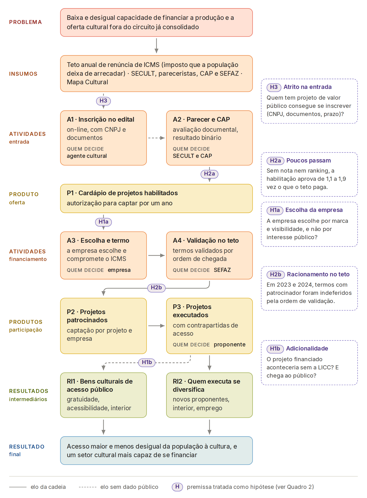

**Resumo.** A Lei de Incentivo à Cultura Capixaba (LICC) permite que contribuintes do ICMS destinem a projetos culturais habilitados pela Secretaria da Cultura (SECULT) valores que recuperam integralmente como crédito presumido do imposto. Este artigo avalia o desenho da política como ela está e estrutura uma avaliação de impacto. Reconstruímos a teoria da mudança, separando entrada, financiamento e entrega, e auditamos cinco premissas com os anexos oficiais de 2022 a 2026 e o Mapa Cultural. Duas premissas não são atendidas pelo desenho: a habilitação qualifica sem priorizar, e o excesso de demanda é racionado pela ordem de chegada dos termos de patrocínio. Em 2023 e 2024, termos equivalentes a 28% e 35% do montante foram indeferidos. A premissa de que as empresas escolhem pelo interesse público é contestada: duas empresas respondem por metade da renúncia de 2025, mas a escolha não mostra viés territorial forte. A entrada e a entrega são indeterminadas, porque a SECULT não publica os inscritos nem o público alcançado. Propomos três perguntas de avaliação (a adicionalidade do financiamento, o efeito do atrito na entrada e o papel da avaliação da SECULT), com parâmetros, vieses, estratégias candidatas, fontes de dados e poder estatístico.

**Palavras-chave:** incentivo fiscal à cultura; gasto tributário; teoria da mudança; funil de atrito; avaliação de impacto.

# 1 Introdução

Em 2021, o Espírito Santo criou um mecanismo estadual de incentivo fiscal à cultura, descrito pela própria Secretaria da Cultura como iniciativa inédita no estado (SECULT, [202-]). A Lei estadual nº 11.246/2021 incluiu na lei do ICMS um crédito presumido igual ao valor que o contribuinte destina a projetos culturais credenciados pela SECULT, com efeitos a partir de 2022 (ESPÍRITO SANTO, 2021a). A Lei de Incentivo à Cultura Capixaba, como o mecanismo passou a ser chamado no regulamento (ESPÍRITO SANTO, 2021b), cresceu depressa: o montante anual de renúncia passou de R\$ 15 milhões em 2023 para R\$ 31 milhões em 2026,[^teto2022] e 463 projetos foram habilitados a captar R\$ 184 milhões nos cinco ciclos (459 com valor publicado). De 2023 a 2025, a captação esgotou o montante de cada ano ao centavo; em 2025, 63 projetos captaram exatamente R\$ 25.000.000,00.[^repo]

[^teto2022]: Para 2022, a Portaria SEFAZ nº 09-R fixou R\$ 10 milhões, e o anexo de captação da SECULT informa R\$ 15 milhões disponíveis (R\$ 11,5 milhões validados). Sem o ato de ampliação, o montante de 2022 fica indeterminado entre os dois valores.

[^repo]: Todos os números deste artigo vêm dos anexos oficiais da SECULT ("Lista de projetos habilitados" e "Recurso financeiro captado", de 2022 a 2026), de bases públicas do IBGE, do Tesouro Nacional (SICONFI) e do Ministério da Cultura (SALIC). A lista de habilitados foi transcrita na versão disponível em 3 set. 2026 (repositório licc.gov); a SECULT atualizou o arquivo em 10 set. 2026, e os status publicados podem ter mudado desde então. Dados, scripts e tabelas estão em <https://github.com/fcarva/aval-pol>, nos diretórios `dados/`, `analise/` e `analise/tabelas/`.

Nenhuma das normas da LICC diz qual problema ela enfrenta. O diagnóstico precisa ser reconstruído. O setor cultural capixaba é pequeno para o tamanho da economia do estado: em 2024, ocupava 4,2% dos trabalhadores do ES, contra 5,8% no país, a 18ª participação entre as 27 unidades da federação (IBGE, 2025). A desigualdade relevante, porém, é interna. Em 2021, 95% da população da Região Metropolitana da Grande Vitória (RMGV) vivia em município com cinema, contra 34% da população do interior; metade dos municípios do interior não tinha fundo municipal de cultura e só 16% tinham plano municipal (IBGE, 2022). Propomos, por isso, formular o problema como uma carência: **a baixa e desigual capacidade de financiar a produção e a oferta cultural fora do circuito já consolidado**, com causas na restrição de financiamento de pequenos produtores, na concentração de equipamentos e de capacidade institucional e na dependência de poucos financiadores.

Avaliar a LICC se justifica por três razões. Primeiro, é gasto público que não passa pelo lado da despesa do orçamento: a renúncia efetiva equivale a 14% a 21% do gasto estadual direto na função cultura em 2022-2025 (SECULT, 2026c; BRASIL, 2026a). Segundo, quem decide o destino do recurso é a empresa patrocinadora, e não o Estado, o que torna a política exposta às críticas de concentração e de lógica de marketing feitas à Lei Rouanet (SILVA, 2017; DEKKER; RODRIGUES, 2019). Terceiro, a política é nova e muda de regra a cada ano; sua primeira avaliação, conduzida pelo Instituto Jones dos Santos Neves com a SECULT e a FAPES, teve resultados preliminares apresentados em julho de 2026 (SECULT, 2026d), aos quais este artigo não teve acesso.

O artigo tem dois objetivos, definidos pela disciplina: avaliar o desenho da LICC **como ela está**, sem propor redesenho do mecanismo, e estruturar uma avaliação de impacto, com desenho amostral, fontes de dados e cálculo de poder. A seção 2 caracteriza a política; a seção 3 revisa a literatura; a seção 4 reconstrói a teoria da mudança e audita suas premissas com os dados administrativos; a seção 5 transforma as premissas em perguntas de avaliação de impacto; a seção 6 conclui.

# 2 Caracterização da política

A LICC é um **gasto tributário com escolha privada**. O proponente, pessoa jurídica com finalidade cultural e sede no estado há dois anos, inscreve o projeto na SECULT. Se o projeto for habilitado, o proponente procura uma empresa contribuinte do ICMS que aceite patrocinar. A empresa deposita o valor numa conta do projeto e compensa até 100% dele com o ICMS devido (ESPÍRITO SANTO, 2021b, art. 10). Não há contrapartida financeira da empresa. O Quadro 1 resume as regras.

**Quadro 1 – Elementos do desenho da LICC**

| Elemento | Regra vigente | Norma |
|--------------|----------------------------------|------------------|
| Benefício ao patrocinador | Crédito presumido de até 100% do patrocínio, compensado com o ICMS a recolher | Lei 7.000/2001, art. 5º-B, IX; Dec. 5.035-R/2021, art. 10 |
| Teto anual | Fixado pela SEFAZ até 31/01, ampliável no exercício, limitado a 2% do ICMS estadual do ano anterior: R\$ 10 mi em 2022 (15 mi no anexo de captação da SECULT), 15 mi (2023), 25 mi (2024 e 2025), 31 mi (2026) | Dec. 5.035-R/2021, art. 4º; Dec. 5.210-R/2022; portarias SEFAZ |
| Limite por patrocinador | 20%, 15%, 10% ou 5% do ICMS recolhido no ano anterior, conforme a faixa de imposto | Dec. 5.035-R/2021, art. 10, § 1º |
| Proponentes | Pessoa jurídica com finalidade cultural e sede no ES há 2 anos; até 3 inscrições por ano | Dec. 5.035-R/2021, art. 5º; IN 001/2025, art. 13 |
| Limite por projeto | R\$ 500 mil; R\$ 300 mil em primeira edição; R\$ 1 milhão para patrimônio e longa-metragem | IN 001/2025, arts. 14-16 |
| Seleção | Parecer técnico e deliberação de comissão paritária (CAP) sobre nove critérios qualitativos, sem pontuação prevista em norma; resultado binário | Dec. 5.035-R/2021, art. 14; IN 001/2025, arts. 37-42 |
| Alocação entre habilitados | Pela empresa patrocinadora; reservas do teto: 30% para eventos com mais de 10 anos, 10% para planos plurianuais, 10% para projetos fora da RMGV, 50% para os demais | IN 001/2025, art. 18 |
| Contrapartidas | Ao menos cinco, de um cardápio de acesso, gratuidade, descentralização, ações afirmativas e acessibilidade | IN 001/2025, arts. 35-36 |
| Controle | Extrato no Diário Oficial a cada repasse; prestação de contas focada no cumprimento do objeto; fiscalização presencial por amostragem | Dec. 5.035-R/2021, arts. 17-19 |

Fonte: elaboração própria a partir das normas citadas (ESPÍRITO SANTO, 2021a; 2021b; SECULT, 2025a; 2026a).

Três características do arranjo pesam na avaliação. A primeira é a **delegação da escolha**: o Estado define quem pode receber; a empresa define quem recebe. A segunda é a **instabilidade**: a SECULT edita uma instrução normativa por ano e, alegando esgotamento do teto, fechou as inscrições no meio de 2024 e alterou o fluxo de habilitação no meio de 2025 (SECULT, 2024b; 2025b). Em 2023 e 2024, a comissão habilitava o projeto e abria um prazo de captação de um ano, prorrogável uma vez; o projeto que terminasse o prazo sem compromissos de ao menos 50% do valor aprovado era arquivado (SECULT, 2023a; 2024a, arts. 32-36). Em 2025 a ordem se inverteu: o projeto só vai à comissão com termos de patrocínio de ao menos 35% do valor (SECULT, 2025a, arts. 41-45) ou, desde maio, com carta de intenção de patrocínio apresentada em 120 dias, sob pena de arquivamento (SECULT, 2025b). A terceira é a **pouca informação publicada**: os anexos não trazem o CNPJ do proponente, a sede, os inscritos não habilitados nem qualquer indicador de resultado.

# 3 Breve revisão da literatura

**Despesa tributária com decisão privada.** A literatura de economia da cultura trata o incentivo fiscal como um subsídio em que o contribuinte decide a alocação e o Tesouro paga a conta. Feld, O'Hare e Schuster (1983) chamaram os contribuintes americanos de "mecenas apesar de si mesmos"; Schuster (2006) sistematiza os instrumentos; Brooks (2004) mostra que, nos Estados Unidos, a renúncia supera muitas vezes o apoio federal direto às artes e serve a públicos diferentes. A justificativa econômica usual é de falha de mercado: a produtividade estagnada das artes ao vivo (BAUMOL; BOWEN, 1966) e o caráter de bem público ou meritório da cultura (THROSBY, 1994). O crédito de 100% da LICC ocupa o extremo desse espectro: o doador não tem custo líquido algum.

**A experiência brasileira com a Lei Rouanet.** A LICC reproduz o núcleo do mecenato federal, que acumula três décadas de crítica. Os estudos documentam concentração regional no Sudeste, sobretudo em São Paulo e no Rio de Janeiro (SILVA, 2017; TEIXEIRA; XAVIER; FARIA, 2024), maior que a do PIB (GUIMARÃES, 2020), concentração persistente de patrocinadores e proponentes (COSTA; MEDEIROS; BUCCO, 2017) e a formação de um "mercado de patrocínios" com intermediários e departamentos de marketing (BELEM; DONADONE, 2013). Dekker e Rodrigues (2019) concluem que a lei beneficiou sobretudo projetos já bem-sucedidos e que não fica claro qual falha de mercado ela corrige. O Tribunal de Contas da União recomendou que as ações financiadas por renúncias tenham objetivos, indicadores e metas (BRASIL, 2014) e determinou ao Ministério da Cultura que não autorizasse a captação por projetos com forte potencial lucrativo ou capacidade de atrair investimento privado suficiente (BRASIL, 2016). Silva (2017) oferece o contraponto: a concentração convive com uma cauda longa de projetos pequenos, e faltam estudos sobre o efeito no acesso da população.

**Evidência causal.** Não localizamos avaliação causal de incentivo cultural no Brasil; os estudos de leis estaduais via ICMS são descritivos: em Minas Gerais, a captação pela lei estadual concentrou-se na região metropolitana de Belo Horizonte, e municípios com museu, teatro ou cinema tinham mais chance de captar (TEIXEIRA *et al.*, 2021). Fora da cultura, Colombo e Cruz (2023) avaliam outro gasto tributário, a Lei do Bem, com pareamento e diferenças em diferenças: há efeito sobre o gasto em P&D, o pessoal de pesquisa e o emprego, mas não sobre os resultados de inovação. No exterior, o análogo mais próximo em instrumento são os créditos estaduais ao audiovisual nos Estados Unidos, cujas avaliações, com adoção escalonada e variáveis instrumentais, encontram efeitos pequenos e concentrados na atividade incentivada — mais filmagens de séries, pouco ou nenhum emprego adicional — e nenhum efeito macroeconômico (THOM, 2018; BUTTON, 2019; BRADBURY, 2020). Com grandes eventos, a Capital Europeia da Cultura elevou em 4,5% o PIB per capita das regiões das cidades-sede (GOMES; LIBRERO-CANO, 2018). Entre recurso público e privado, os resultados vão de leve *crowding-in* à independência (BORGONOVI; O'HARE, 2004). Duas lições servem à LICC: em instrumentos que financiam produções dispersas, os efeitos plausíveis são proximais e pequenos; e os desenhos críveis usam como comparação candidatos não escolhidos, como as cidades candidatas à Capital Europeia da Cultura.

# 4 Desenho da política e sua avaliação

## 4.1 Teoria da mudança

Como a LICC não explicita sua lógica, reconstruímos a teoria da mudança (Figura 1) pelos cinco passos do J-PAL usados na disciplina: propósito, cadeia causal, premissas e riscos, hipótese causal e indicadores. Na cadeia de resultados de Gertler *et al.* (2018), os produtos estão sob controle da agência que implementa. Na LICC, o produto "projeto patrocinado" depende de um terceiro ator, a empresa, que decide quem recebe. Por isso a Figura 1 separa três cadeias, como recomendam White e Raitzer (2017): a entrada (inscrição e habilitação), o financiamento (escolha da empresa e validação até o teto) e a entrega, e indica quem decide em cada elo.

A hipótese causal, no gabarito do J-PAL, é: *se* a SECULT abre a inscrição e habilita projetos culturais, e empresas contribuintes patrocinam parte deles com o ICMS que pagariam, *então* se forma um cardápio de projetos habilitados e um conjunto de projetos patrocinados e executados, *o que deveria levar* a mais bens culturais de acesso público, executados por proponentes mais diversos e mais capazes, *que ao final melhorarão* o acesso da população à cultura e reduzirão sua desigualdade territorial, *contribuindo para* ampliar e desconcentrar a capacidade de financiar a cultura no estado.

Cada seta da cadeia carrega uma premissa, uma condição que precisa valer para que um passo leve ao seguinte (MAYNE, 2015). Tratamos cinco delas como hipóteses a testar, marcadas nos elos da Figura 1 e auditadas no Quadro 2: o atrito na entrada (H3), a habilitação que qualifica sem priorizar (H2a), a escolha da empresa (H1a), o racionamento no teto (H2b) e a adicionalidade (H1b). H2 descreve o que se perde ao longo do funil; H1 e H3 são explicações concorrentes para a perda.

**Figura 1 – Teoria da mudança da LICC, com as premissas testadas**

{width=16cm}

Fonte: elaboração própria, no formato de cadeia de resultados do J-PAL usado por Gertler *et al.* (2018), com base nas normas do Quadro 1. Setas tracejadas indicam elos sem dado público.

## 4.2 Avaliação do desenho

Aplicamos as perguntas de avaliação de desenho do material da disciplina: o problema está formulado? os objetivos são mensuráveis? cada elo tem premissa crível e indicador? quanto se perde ao longo da cadeia? Pelo mecanismo de mapeamento de Williams (2020), a premissa de cada elo é confrontada com o contexto real e classificada como sustentada, não atendida, contestada ou indeterminada (Quadro 2).

**Problema e objetivos.** A lei não tem artigo de objetivos. O decreto declara na ementa um objetivo de produto, "estimular a realização de projetos culturais". O art. 3º lista onze finalidades de "interesse público", das quais o projeto deve atender **uma ou mais**. Essas finalidades definem quem é elegível, não o que a política pretende alcançar (ESPÍRITO SANTO, 2021b, art. 3º). Não há meta, magnitude esperada nem indicador. Isso falha o critério de que programas declarem os resultados e a magnitude da contribuição esperada (BARROS; LIMA, 2017) e o padrão de governança de renúncias do TCU (BRASIL, 2014).

**Funil de atrito.** O funil mede, elo a elo, quantos beneficiários potenciais chegam ao fim da cadeia (WHITE; RAITZER, 2017). A Tabela 1 mostra que ele se estreita justamente onde não há dado: antes da habilitação e depois da execução. Entre os 25.441 agentes cadastrados no Mapa Cultural e os cerca de 100 proponentes habilitados por ciclo, não se sabe quantos se inscreveram nem quantos foram inabilitados. Nas etapas observadas, a maioria passa: 68% dos habilitados de 2022-2024 com situação resolvida captaram.

**Tabela 1 – Funil de atrito da LICC**

| Etapa | Valor | Período |
|-------------------------------------------|---------------------------|--------------|
| Agentes culturais cadastrados no Mapa Cultural (coletivos) | 25.441 (2.592) | set. 2026 |
| Projetos inscritos | não publicado | — |
| Projetos habilitados; proponentes por ciclo | 305; 53, 92 e 95 | ciclos 2022-2024 |
| Habilitados com situação resolvida; captaram | 293; 198 | ciclos 2022-2024 |
| Taxa de captação entre os resolvidos | 84%; 70%; 55% | ciclos 2022; 2023; 2024 |
| Valor com patrocinador que coube no teto | 78%; 74% | captação 2023; 2024 |
| Público alcançado e gratuidade | não publicado | — |

Fonte: elaboração própria com base em SECULT (2026b; 2026c) e na API pública do Mapa Cultural do Espírito Santo (SECULT, 2026e). Tabelas de origem: `analise/tabelas/07_funil_por_ciclo.csv`, `07_funil_captacao_anual.csv` e `07_mapa_cultural_universo.csv`.

**Quadro 2 – Auditoria das premissas da teoria da mudança**

| Elo | Premissa | Contexto real | Situação |
|----------|-------------------------|------------------------------------|--------------|
| Entrada (H3) | Quem tem projeto de valor público consegue se inscrever | A inscrição exige CNPJ com finalidade cultural, sede em nome próprio e certidão estadual. 14 municípios do interior nunca tiveram projeto habilitado. Estreantes: 56 no ciclo 2024, 26 em 2025, 40 em 2026 | Indeterminado: sem inscritos |
| Habilitação (H2a) | O mérito avaliado pela SECULT orienta quem é financiado | O parecer indica, por critério, se o projeto atende ou não, e a CAP decide só habilitar ou não, em fluxo contínuo; não há nota nem ordem de prioridade. Em 2022-2024, 95 de 293 habilitados expiraram sem captar | Não atendida |
| Escolha (H1a) | A empresa escolhe pelo interesse público, também fora do circuito consolidado | Duas empresas somam metade da renúncia de 2025; energia e gás, 52%. Execução de 68% na RMGV e 63% no interior. Recorrentes captam mais (71% contra 57%) | Contestada |
| Validação (H2b) | O racionamento no teto segue critério público | Em 2023 e 2024, termos com patrocinador de 28% e 35% do montante foram indeferidos pela ordem de chegada | Não atendida |
| Entrega (H1b) | O projeto financiado não aconteceria sem a LICC e chega ao público | A maior reserva do teto (30%) vai a eventos com mais de dez anos. Não há dado de público nem de gratuidade | Indeterminado: sem dado |

Fonte: elaboração própria, no formato do mecanismo de mapeamento de Williams (2020), com base nas normas do Quadro 1, em SECULT (2026b; 2026c) e nas tabelas `03_*.csv` e `07_*.csv` de `analise/tabelas/`.

**Entrada.** Pessoa física não se inscreve e o microempreendedor individual tem limite de valor (SECULT, 2025a, arts. 17 e 19). Em 2024 as inscrições foram fechadas no meio do ano por esgotamento do teto (SECULT, 2024b), e desde 2025 o proponente precisa conseguir o patrocinador antes da comissão. No mesmo período, a entrada de proponentes novos caiu (estreante é quem não foi habilitado nos dois ciclos anteriores). A difusão territorial parou: 39 municípios tiveram o primeiro projeto habilitado em 2022, 16 em 2023 e 3 por ciclo desde então. Nada disso isola o atrito, porque teto, janelas e regras mudaram ao mesmo tempo. O custo de entrada é o que a literatura chama de custo administrativo (MOYNIHAN; HERD; HARVEY, 2015). Ele pode excluir sem selecionar ou funcionar como triagem (FINKELSTEIN; NOTOWIDIGDO, 2019), e só uma variação exógena desse custo distingue os dois casos.

**Habilitação e validação.** A análise tem três etapas: documentação, parecer técnico sobre os nove critérios do decreto e deliberação da comissão por maioria simples. O parecer "deverá indicar a habilitação ou inabilitação" (ESPÍRITO SANTO, 2021b, art. 14; SECULT, 2025a, arts. 37-42). A comissão se reúne semanalmente e o certificado de aptidão sai projeto a projeto (SECULT, 2023b, art. 9º; 2025a, arts. 40 e 45): os inscritos não disputam vagas entre si, e por isso não há classificação. Nenhuma norma lida prevê nota, peso, nota de corte ou ordem de prioridade, e no Mapa Cultural as fases de parecer e de comissão estão registradas como "avaliação simplificada", não como avaliação técnica (SECULT, 2026e). O modelo de parecer também não atribui nota: para cada critério, o parecerista indica se o projeto "atende ou não" e, ao final, sugere habilitação, inabilitação ou diligência (SECULT, 2026f). A única pontuação do processo é a dos pareceristas, no edital que os credencia. A habilitação qualifica, mas não prioriza, e autoriza mais do que o teto financia. A escolha entre projetos considerados aptos passa, assim, à empresa e à fila de validação. Com o montante esgotado de 2023 a 2025, o excesso de demanda com patrocinador foi racionado pela ordem de chegada dos termos, não por mérito (SECULT, 2026c).

**Escolha da empresa.** Com crédito integral, a empresa escolhe o destino do ICMS que pagaria e fica com a marca; como o limite por patrocinador é uma fração do ICMS recolhido (Quadro 1), as maiores contribuintes têm mais espaço para patrocinar. Imagem e relações de negócio estão entre os motivos do patrocínio (O'HAGAN; HARVEY, 2000), e a filantropia empresarial também serve de canal de influência política (BERTRAND *et al.*, 2020). Entre as companhias abertas brasileiras, a chance de patrocinar cultura cresce com o porte da empresa e com a concentração do setor (ALCÂNTARA; BENEDICTO; SILVA, 2019). Das 26 empresas que patrocinaram em 2025, 13 também aparecem como incentivadoras da Lei Rouanet, e elas responderam por 86% da renúncia daquele ano (BRASIL, 2026b). A evidência sobre o destino é mista. Quando a busca de patrocinador passou para antes da comissão, a parcela da RMGV no valor habilitado atribuível a um município caiu de 74% (ciclo 2024) para 57% (2025). Projetos que pediram exatamente o teto de R\$ 500 mil foram executados com mais frequência que os menores. Esses fatos têm explicações que não dependem da marca: quem já tem patrocinador acertado pede o teto, e quem já captou tem rede e experiência. Daí a premissa ficar contestada.

**Entrega e território.** A maior reserva do teto, 30%, vai a eventos com mais de dez anos de existência, justamente os de maior chance de financiamento sem incentivo. É uma tensão com o critério do TCU (BRASIL, 2016) que fica como hipótese a testar, não como descumprimento apurado. A RMGV tem 49% da população e fica com 67% do valor atribuível a um município. O Gini do valor entre os 78 municípios é 0,88, e a diferença entre RMGV e interior explica só 7% da desigualdade na decomposição de Theil. Por isso a reserva de 10% para projetos fora da RMGV age sobre a menor parte dela.

**Monitoramento.** O que a SECULT publica cobre insumos e produtos, mas não a entrada (inscritos e inabilitados) nem o resultado (público, gratuidade, contrapartidas executadas). Os dois indicadores que a teoria da mudança mais exige falham no critério SMART de ser mensurável e atribuível. A lei já manda o regulamento definir a divulgação dos benefícios, "inclusive no Portal da Transparência do Estado" (ESPÍRITO SANTO, 2021a).

Em síntese, com o dado público nenhum elo aparece claramente rompido. Duas premissas de critério não são atendidas pelo desenho: habilitar sem priorizar e racionar pela ordem de chegada. A escolha da empresa é contestada, e a entrada e a entrega ficam indeterminadas por falta de dado. A avaliação de impacto da seção 5 é desenhada para resolver as três últimas.

# 5 Proposta de avaliação de impacto

## 5.1 Perguntas e parâmetros

Como no material do J-PAL, as premissas do Quadro 2 viram perguntas de pesquisa: três perguntas de avaliação (Quadro 3), na notação de resultados potenciais. Seja *i* a unidade, *T* o tratamento e *Y*(1) e *Y*(0) os resultados com e sem ele. O Quadro 3 mostra também por que a comparação simples entre grupos não responde a nenhuma delas. A diferença simples de médias é igual ao efeito médio mais um viés de seleção e um viés de efeitos heterogêneos.

**Quadro 3 – Perguntas de avaliação**

| Hipótese | Pergunta | Unidade, tratamento e resultado | Parâmetro | Viés da comparação simples |
|---------|----------------|----------------|-------------|------------------|
| H1b | Qual é o efeito de captar pela LICC sobre a realização e o alcance do projeto? | Projeto habilitado; *T* = captou; *Y* = o bem cultural acontece; público e gratuidade | Efeito médio sobre os tratados (EMPT) e seu contraste com o efeito sobre os não tratados (EMPNT) | Se a empresa escolhe eventos consolidados, *Y*(0) é maior entre os escolhidos e o efeito é menor onde ela escolhe: os dois vieses subestimam a adicionalidade |
| H3 | Qual é o efeito de reduzir o custo de entrada sobre a inscrição, a habilitação e o perfil de quem entra? | Agente cultural sem inscrição prévia; *T* = oferta de apoio à inscrição; *Y* = inscreveu-se, foi habilitado, captou | Efeito da oferta (intenção de tratar) e efeito local para quem responde a ela | Quem se inscreve por conta própria tem mais capacidade: viés de seleção |
| H2a | A habilitação muda o destino do projeto, e a empresa segue o mérito avaliado pela SECULT? | Projeto inscrito; *T* = habilitado; *Y* = o projeto é executado | Efeito de ser habilitado (oferta) na margem da decisão | Inabilitados diferem dos habilitados em qualidade e capacidade |

Fonte: elaboração própria, com base em Gertler *et al.* (2018) e no material da disciplina sobre resultados potenciais.

O EMPT é o parâmetro indicado porque a participação é voluntária, do proponente e da empresa.

## 5.2 Estratégias de identificação candidatas

As regras de operação determinam o método (GERTLER *et al.*, 2018). Com excesso de demanda, ciclos anuais e nenhum índice publicado com ponto de corte, cabem sorteio, promoção aleatória, diferenças em diferenças e diferenças em diferenças com pareamento. A escolha depende dos dados que a SECULT liberar (seção 5.3).

- **H1b.** Em 2023 e 2024, os termos validados pouco antes do esgotamento do teto e os indeferidos logo depois tinham, todos, patrocinador disposto. Se a ordem de chegada não depender das características do projeto, o que se testa pelo balanço dos observáveis, a comparação é quase experimental. Os 95 habilitados que expiraram sem captar, comparados aos que captaram com diferenças em diferenças e pareamento dentro do ciclo (o desenho de Colombo e Cruz, 2023), delimitam o efeito sem afastar a seleção. O SALIC mostra se as mesmas empresas deixaram de patrocinar pela Rouanet ao entrar na LICC (substituição).
- **H3.** Uma promoção aleatória de apoio à inscrição (informação, orientação sobre CNPJ e documentação) sorteada entre municípios do interior não altera nenhuma regra de alocação. Ela estima o efeito da oferta e, para quem responde a ela, o efeito local (ANGRIST; IMBENS; RUBIN, 1996). Como o teto é fixo, novos entrantes deslocam outros, e sortear também a intensidade da oferta entre municípios mede esse deslocamento (BAIRD *et al.*, 2018).
- **H2a.** Como o parecer não atribui nota, não há ponto de corte para regressão descontínua. A pergunta fica descritiva: se a captação se associa ao que o parecer registrou (critérios atendidos, diligências), com os pareceres obtidos por LAI.

## 5.3 Desenho da amostra e fontes de dados

Para H1b e H2a trabalha-se com o universo, e a listagem vem dos anexos oficiais. São 293 projetos habilitados em 2022-2024 com situação resolvida, de 172 proponentes, e os termos de 2023 e 2024 na margem do racionamento. Para H3, a listagem é o cadastro de agentes do Mapa Cultural, restrito aos que têm CNPJ e nunca se inscreveram. A amostra é por conglomerados: os municípios do interior são sorteados para receber a oferta, e dentro deles entram todos os agentes elegíveis. A listagem deixa de fora quem não está cadastrado, o que limita a validade externa (viés de cobertura). O gargalo comum é a chave: os anexos não trazem o CNPJ do proponente, mas a SECULT o tem, porque a inscrição o exige. O Quadro 4 lista as fontes.

**Quadro 4 – Fontes de dados da avaliação**

| Fonte | Conteúdo | Uso | Acesso |
|----------------|------------------------|-----------------|------------|
| Inscrições da SECULT (Mapa Cultural) | Todas as inscrições, inclusive inabilitadas e arquivadas, com motivo, parecer, CNPJ, sede e datas | H2a, H3; chave de ligação | Pedido por LAI |
| Anexos de habilitados e captados; extratos do Diário Oficial | Status, valores, patrocinador e data de cada repasse | H1b; tratamento e intensidade | Público |
| SEFAZ | Data e ordem de validação dos termos, inclusive indeferidos | H1b (racionamento) | Pedido por LAI |
| Relatórios de execução | Público, gratuidade, locais, contrapartidas | *Y* de H1b | Interno |
| Mapa Cultural (API) | Agentes, espaços e agenda de eventos por município | Listagem de H3; ocorrência de eventos (*Y* de H1b) | Público |
| SALIC (Ministério da Cultura) | Projetos e doações pela Rouanet, por CNPJ | Substituição de fonte (H1b) | Público |

Fonte: elaboração própria.

## 5.4 Cálculo do poder estatístico

Para resultados binários, o efeito mínimo detectável (EMD), em pontos percentuais, é:

$$\text{EMD} = (t_{1-\alpha/2} + t_{1-\beta})\,\sqrt{\frac{p_0(1-p_0)}{T(1-T)\,n}}\,\sqrt{1+\left[(cv^2+1)\,\bar m-1\right]\rho}.$$

A fórmula segue o material da disciplina (DJIMEU; HOUNDOLO, 2016), com α = 5% bicaudal e poder de 80%. Nela, $p_0$ é a proporção no grupo de comparação, $T$ a fração tratada, $n$ o número de unidades, e o último termo é o efeito do desenho quando as unidades vêm em grupos (projetos de um mesmo proponente, agentes de um mesmo município), com tamanho médio $\bar m$, coeficiente de variação $cv$ e correlação intragrupo $\rho$ (ELDRIDGE; ASHBY; KERRY, 2006). Com conglomerados sorteados, usa-se a forma equivalente por número de conglomerados. A Tabela 2 reporta os cenários. $p_0$ e $\rho$ são hipóteses, a calibrar com os dados pedidos.

**Tabela 2 – Efeito mínimo detectável por pergunta (pontos percentuais)**

| Pergunta e comparação | Unidades | Cenários | EMD |
|------------------------------------------|---------------------|--------------------|---------|
| H1b: captou × expirou, 2022-2024 | 293 projetos (*T* = 0,68), 172 proponentes ($\bar m$ = 1,70; *cv* = 0,75) | $p_0$ de 0,2 a 0,6; ρ = 0 ou 0,2 | 14 a 20 |
| H1b: margem do racionamento, 2023-2024 | 20 a 30 projetos por grupo | $p_0$ de 0,2 a 0,6 | 29 a 43 |
| H3: oferta sorteada por agente | 1.000 a 4.000 agentes | $p_0$ de 2% a 10% | 1,2 a 5,3 |
| H3: oferta sorteada por município | 71 municípios do interior, 20 a 50 agentes cada | $p_0$ de 5% a 10%; ρ de 0,02 a 0,05 | 2,9 a 6,3 |

Fonte: elaboração própria; `analise/tabelas/07_poder_hipoteses.csv` (script `analise/07_hipoteses_h1_h3.py`, com as funções de `analise/05_poder_mde.py`).

A comparação na margem do racionamento só detecta efeitos muito grandes e serve como verificação de robustez. A comparação entre quem captou e quem expirou tem poder razoável, mas seu problema é o viés, não a amostra. O desenho de H3 detecta efeitos de poucos pontos. Com poder baixo, uma estimativa "significativa" tende a exagerar o efeito verdadeiro (GELMAN; CARLIN, 2014), o que recomenda pré-registrar o plano de análise.

## 5.5 Ameaças à validade e ética

A primeira ameaça à validade interna é a violação da hipótese de ausência de interferência entre unidades (SUTVA): com o teto fixo, o que um projeto capta falta a outro. Seguem-se a substituição (quem não capta pode executar com outra fonte; o SALIC entra como resultado), a seleção por fatores que mudam no tempo, os eventos externos do período (Lei Paulo Gustavo e Política Nacional Aldir Blanc) e o atrito dos dados: projeto sem registro não é projeto que não aconteceu. A validade externa é limitada. As comparações de H1b valem para o regime de 2022-2024, em que a habilitação precedia a busca por patrocinador. Desde 2025 essa ordem se inverteu e os expirados quase desapareceram (3 em 56 resolvidos no ciclo 2025). No plano ético, nenhum desenho nega ou adia o acesso de elegíveis, e a oferta de apoio só acrescenta informação. O uso de dados identificados exige anonimização, conforme a LGPD, e uma pesquisa com o público exigiria aprovação de comitê de ética.

# 6 Conclusão

A LICC é um gasto tributário de crescimento rápido, sem problema declarado, sem objetivos mensuráveis e sem previsão de avaliação, em que o Estado define quem pode receber e as empresas decidem quem recebe. Duas premissas de critério não são atendidas pelo desenho: a habilitação qualifica sem priorizar, e o racionamento no teto segue a ordem de chegada. A escolha pelas empresas é contestada: o financiamento vem de poucas empresas de serviços regulados, mas sem viés territorial forte. A entrada e a entrega, os extremos da cadeia, são indeterminadas, porque a SECULT não publica os inscritos nem o público alcançado.

Sem mexer no mecanismo, há recomendações que dependem só da gestão: declarar objetivos, metas e indicadores; publicar os inscritos e os motivos de inabilitação; publicar, por projeto, o CNPJ do proponente, a sede, a captação por cota e as datas; e publicar as contrapartidas executadas e o público alcançado.

A proposta de avaliação transforma as premissas em três perguntas: a adicionalidade do financiamento (H1b), pelo racionamento no teto e pelos habilitados que não captaram; o efeito do atrito na entrada (H3), por uma oferta sorteada de apoio à inscrição, com bom poder; e o papel da avaliação da SECULT (H2a), descritivo porque o parecer não dá nota. As limitações são as dos dados. A situação publicada serve de aproximação para a captação, a estreia é medida por nome de proponente, e o retrato territorial cobre 74% do valor.

# Referências

ALCÂNTARA, Jessica Nunes de; BENEDICTO, Gideon Carvalho de; SILVA, Sabrina Soares da. Possible key factors for Brazilian publicly traded companies to adopt a sponsorship strategy. **Journal of Strategy and Management**, v. 12, n. 4, p. 429-446, 2019. DOI: 10.1108/JSMA-04-2018-0029.

ANGRIST, Joshua D.; IMBENS, Guido W.; RUBIN, Donald B. Identification of causal effects using instrumental variables. **Journal of the American Statistical Association**, v. 91, n. 434, p. 444-455, 1996. DOI: 10.1080/01621459.1996.10476902.

BAIRD, Sarah; BOHREN, J. Aislinn; McINTOSH, Craig; ÖZLER, Berk. Optimal design of experiments in the presence of interference. **The Review of Economics and Statistics**, v. 100, n. 5, p. 844-860, 2018. DOI: 10.1162/rest_a_00716.

BARROS, Ricardo Paes de; LIMA, Lycia. Avaliação de impacto de programas sociais: por que, para que e quando fazer? *In*: MENEZES FILHO, Naercio Aquino; PINTO, Cristine Campos de Xavier (org.). **Avaliação econômica de projetos sociais**. 3. ed. São Paulo: Fundação Itaú Social, 2017. p. 13-37.

BAUMOL, William J.; BOWEN, William G. **Performing arts**: the economic dilemma. New York: The Twentieth Century Fund, 1966.

BELEM, Marcela Purini; DONADONE, Julio Cesar. A Lei Rouanet e a construção do "mercado de patrocínios culturais". **NORUS – Novos Rumos Sociológicos**, Pelotas, v. 1, n. 1, 2013. Disponível em: https://periodicos.ufpel.edu.br/index.php/NORUS/article/view/2761.

BERTRAND, Marianne; BOMBARDINI, Matilde; FISMAN, Raymond; TREBBI, Francesco. Tax-exempt lobbying: corporate philanthropy as a tool for political influence. **American Economic Review**, v. 110, n. 7, p. 2065-2102, 2020. DOI: 10.1257/aer.20180615.

BORGONOVI, Francesca; O'HARE, Michael. The impact of the National Endowment for the Arts in the United States: institutional and sectoral effects on private funding. **Journal of Cultural Economics**, v. 28, n. 1, p. 21-36, 2004. DOI: 10.1023/B:JCEC.0000009823.76834.64.

BRADBURY, J. C. Do movie production incentives generate economic development? **Contemporary Economic Policy**, v. 38, n. 2, p. 327-342, 2020. DOI: 10.1111/coep.12443.

BRASIL. Tribunal de Contas da União. **Acórdão nº 1.205/2014 – Plenário**. Relator: Raimundo Carreiro. Brasília, 14 maio 2014.

BRASIL. Tribunal de Contas da União. **Acórdão nº 191/2016 – Plenário**. Relator: Augusto Sherman Cavalcanti. Brasília, 3 fev. 2016.

BRASIL. Secretaria do Tesouro Nacional. **SICONFI**: Declaração de Contas Anuais (DCA) do Estado do Espírito Santo e de seus municípios, 2021-2025. Brasília: STN, 2026a. Disponível em: https://apidatalake.tesouro.gov.br/ords/siconfi/tt/dca. Acesso em: 23 set. 2026.

BRASIL. Ministério da Cultura. **SALIC**: API de dados abertos (projetos e incentivadores da Lei Rouanet). Brasília: MinC, 2026b. Disponível em: https://api.salic.cultura.gov.br/api/v1. Acesso em: 24 set. 2026.

BROOKS, A. C. In search of true public arts support. **Public Budgeting & Finance**, v. 24, n. 2, p. 88-100, 2004. DOI: 10.1111/j.0275-1100.2004.02402006.x.

BUTTON, Patrick. Do tax incentives affect business location and economic development? Evidence from state film incentives. **Regional Science and Urban Economics**, v. 77, p. 315-339, 2019. DOI: 10.1016/j.regsciurbeco.2019.06.002.

COLOMBO, Daniel Gama e; CRUZ, Hélio Nogueira da. Impact assessment of innovation tax incentives in Brazil. **Innovation & Management Review**, v. 20, n. 1, p. 28-42, 2023. DOI: 10.1108/INMR-11-2020-0167.

COSTA, Camila Furlan da; MEDEIROS, Igor Baptista de Oliveira; BUCCO, Guilherme Brandelli. O financiamento da cultura no Brasil no período 2003-15: um caminho para geração de renda monopolista. **Revista de Administração Pública**, Rio de Janeiro, v. 51, n. 4, p. 509-527, 2017. DOI: 10.1590/0034-7612162254.

DEKKER, Erwin; RODRIGUES, Ana Carolina. The political economy of Brazilian cultural policy: a case study of the Rouanet Law. **Journal of Public Finance and Public Choice**, v. 34, n. 2, p. 149-171, 2019. DOI: 10.1332/251569119X15675896589688.

DJIMEU, Eric W.; HOUNDOLO, Deo-Gracias. Power calculation for causal inference in social science: sample size and minimum detectable effect determination. **Journal of Development Effectiveness**, v. 8, n. 4, p. 508-527, 2016. DOI: 10.1080/19439342.2016.1244555.

ELDRIDGE, Sandra M.; ASHBY, Deborah; KERRY, Sally. Sample size for cluster randomized trials: effect of coefficient of variation of cluster size and analysis method. **International Journal of Epidemiology**, v. 35, n. 5, p. 1292-1300, 2006. DOI: 10.1093/ije/dyl129.

ESPÍRITO SANTO (Estado). Lei nº 11.246, de 7 de abril de 2021. Introduz alterações na Lei nº 7.000, de 27 de dezembro de 2001. **Diário Oficial dos Poderes do Estado**, Vitória, 8 abr. 2021a.

ESPÍRITO SANTO (Estado). Decreto nº 5.035-R, de 15 de dezembro de 2021. Dispõe sobre a regulamentação do incentivo fiscal concedido nos termos do art. 5º-B, IX, da Lei nº 7.000, de 27 de dezembro de 2001. **Diário Oficial dos Poderes do Estado**, Vitória, 16 dez. 2021b.

FELD, Alan L.; O'HARE, Michael; SCHUSTER, J. Mark Davidson. **Patrons despite themselves**: taxpayers and arts policy. New York: New York University Press, 1983.

FINKELSTEIN, Amy; NOTOWIDIGDO, Matthew J. Take-up and targeting: experimental evidence from SNAP. **The Quarterly Journal of Economics**, v. 134, n. 3, p. 1505-1556, 2019. DOI: 10.1093/qje/qjz013.

GELMAN, Andrew; CARLIN, John. Beyond power calculations: assessing type S (sign) and type M (magnitude) errors. **Perspectives on Psychological Science**, v. 9, n. 6, p. 641-651, 2014. DOI: 10.1177/1745691614551642.

GERTLER, Paul J.; MARTÍNEZ, Sebastián; PREMAND, Patrick; RAWLINGS, Laura B.; VERMEERSCH, Christel M. J. **Avaliação de impacto na prática**. 2. ed. Washington, DC: Banco Interamericano de Desenvolvimento; Banco Mundial, 2018.

GOMES, Pedro; LIBRERO-CANO, Alejandro. Evaluating three decades of the European Capital of Culture programme: a difference-in-differences approach. **Journal of Cultural Economics**, v. 42, n. 1, p. 57-73, 2018. DOI: 10.1007/s10824-016-9281-x.

GUIMARÃES, Bruno Costa. Concentração cultural: por que podemos dizer que, no Brasil, o investimento na cultura está mais concentrado que o PIB? **Mediações – Revista de Ciências Sociais**, Londrina, v. 25, n. 2, 2020. DOI: 10.5433/2176-6665.2020v25n2p412.

IBGE. **Sistema de Informações e Indicadores Culturais**. Rio de Janeiro: IBGE, 2025. Base de dados; períodos 2023 e 2024 publicados em 12 dez. 2025. Disponível em: https://servicodados.ibge.gov.br/api/v1/pesquisas/10092. Acesso em: 23 set. 2026.

IBGE. **Pesquisa de Informações Básicas Municipais – MUNIC 2021**. Rio de Janeiro: IBGE, 2022. Dados consultados pela API de pesquisas do IBGE em 23 set. 2026.

MAYNE, John. Useful theory of change models. **Canadian Journal of Program Evaluation**, v. 30, n. 2, p. 119-142, 2015. DOI: 10.3138/cjpe.230.

MOYNIHAN, Donald; HERD, Pamela; HARVEY, Hope. Administrative burden: learning, psychological, and compliance costs in citizen-state interactions. **Journal of Public Administration Research and Theory**, v. 25, n. 1, p. 43-69, 2015. DOI: 10.1093/jopart/muu009.

O'HAGAN, J.; HARVEY, D. Why do companies sponsor arts events? Some evidence and a proposed classification. **Journal of Cultural Economics**, v. 24, n. 3, p. 205-224, 2000. DOI: 10.1023/A:1007653328733.

SCHUSTER, J. Mark. Tax incentives in cultural policy. *In*: GINSBURGH, V. A.; THROSBY, D. (ed.). **Handbook of the economics of art and culture**. Amsterdam: Elsevier, 2006. v. 1, p. 1253-1298. DOI: 10.1016/S1574-0676(06)01036-2.

SECULT – SECRETARIA DE ESTADO DA CULTURA DO ESPÍRITO SANTO. Instrução Normativa nº 001, de 31 de janeiro de 2023. **Diário Oficial dos Poderes do Estado**, Vitória, 1º fev. 2023a. Disponível em: https://secult.es.gov.br/instrucao-normativa-licc-2023. Acesso em: 24 set. 2026.

SECULT – SECRETARIA DE ESTADO DA CULTURA DO ESPÍRITO SANTO. Regimento interno da Comissão de Avaliação Permanente (CAP) da Lei de Incentivo à Cultura Capixaba. **Diário Oficial dos Poderes do Estado**, Vitória, 16 fev. 2023b. Disponível em: https://secult.es.gov.br/legislacao-licc. Acesso em: 23 set. 2026.

SECULT – SECRETARIA DE ESTADO DA CULTURA DO ESPÍRITO SANTO. Instrução Normativa nº 001, de 31 de janeiro de 2024. **Diário Oficial dos Poderes do Estado**, Vitória, 1º fev. 2024a. Disponível em: https://secult.es.gov.br/instrucao-normativa-licc-2024. Acesso em: 24 set. 2026.

SECULT – SECRETARIA DE ESTADO DA CULTURA DO ESPÍRITO SANTO. Portaria nº 078, de 31 de julho de 2024. Introduz alterações no artigo 12 da Instrução Normativa nº 001 de 31 de janeiro de 2024. Vitória: SECULT, 2024b. Disponível em: https://secult.es.gov.br/media/2024/PORTARIA_SECULT_N%C2%BA_078%2C_DE_31_DE_JULHO_DE_2024.pdf. Acesso em: 23 set. 2026.

SECULT – SECRETARIA DE ESTADO DA CULTURA DO ESPÍRITO SANTO. **Instrução Normativa nº 001/2025, de 14 de janeiro de 2025**. Vitória: SECULT, 2025a.

SECULT – SECRETARIA DE ESTADO DA CULTURA DO ESPÍRITO SANTO. Portaria nº 062-S, de 9 de maio de 2025. Altera a Instrução Normativa nº 001 de 31 de janeiro de 2025. **Diário Oficial dos Poderes do Estado**, Vitória, 2025b.

SECULT – SECRETARIA DE ESTADO DA CULTURA DO ESPÍRITO SANTO. **Instrução Normativa nº 001/2026, de 12 de janeiro de 2026**. Vitória: SECULT, 2026a.

SECULT – SECRETARIA DE ESTADO DA CULTURA DO ESPÍRITO SANTO. **Recursos financeiros captados**: anexos "Recurso financeiro captado" de 2022 a 2026. Vitória: SECULT, 2026c. Disponível em: https://secult.es.gov.br/recursos-financeiros-captados. Acesso em: 24 set. 2026.

SECULT – SECRETARIA DE ESTADO DA CULTURA DO ESPÍRITO SANTO. **Cultura em Dados**: evento apresenta resultados de pesquisa sobre a Lei de Incentivo à Cultura Capixaba (LICC) e o Boletim da Economia Criativa. Vitória: SECULT, 2026d. Disponível em: https://secult.es.gov.br/cultura-em-dados-evento-apresenta-resultados-de-pesquisa-sobre-a-lei-de-incentivo-a-cultura-capixaba-licc-e-o-boletim-da-economia-criativa. Acesso em: 24 set. 2026. [VERIFICAR: página lida só pelo resumo do buscador.]

SECULT – SECRETARIA DE ESTADO DA CULTURA DO ESPÍRITO SANTO. **Mapa Cultural do Espírito Santo**: API pública de agentes e oportunidades (inclusive as fases de avaliação da LICC). Vitória: SECULT, 2026e. Disponível em: https://mapa.cultura.es.gov.br. Acesso em: 24 set. 2026.

SECULT – SECRETARIA DE ESTADO DA CULTURA DO ESPÍRITO SANTO. **Parecer técnico cultural LICC**: modelo padrão. Vitória: SECULT, 2026f. Disponível em: https://secult.es.gov.br/LICC. Acesso em: 24 set. 2026.

SECULT – SECRETARIA DE ESTADO DA CULTURA DO ESPÍRITO SANTO. **Sobre a LICC**. Vitória: SECULT, [202-]. Disponível em: https://secult.es.gov.br/sobre-a-licc. Acesso em: 24 set. 2026.

SECULT – SECRETARIA DE ESTADO DA CULTURA DO ESPÍRITO SANTO. **Lista de projetos habilitados** (seções 2022 a 2026) e **Recurso financeiro captado – 2025**. Vitória: SECULT, 2026b. Disponível em: https://secult.es.gov.br/lista-de-projetos-habilitados. Acesso em: 3 set. 2026.

SILVA, Frederico Augusto Barbosa da. **Financiamento cultural no Brasil contemporâneo**. Brasília: Ipea, 2017. (Texto para Discussão, 2280).

TEIXEIRA, Lusvânio Carlos; XAVIER, Wescley Silva; FARIA, Evandro Rodrigues de; BRAVIM, Márcio Teixeira. Relação entre os equipamentos e políticas culturais dos municípios de Minas Gerais e a captação de recursos via Lei Estadual de Incentivo à Cultura. **Interações**, Campo Grande, v. 22, n. 2, p. 405-419, 2021. DOI: 10.20435/inter.v22i2.2965.

TEIXEIRA, Lusvânio Carlos; XAVIER, Wescley Silva; FARIA, Evandro Rodrigues de. Distribuição geográfica de projetos culturais com captação de recursos via Lei Rouanet. **DRd – Desenvolvimento Regional em Debate**, v. 14, p. 556-578, 2024. DOI: 10.24302/drd.v14.5320.

THOM, Michael. Lights, camera, but no action? Tax and economic development lessons from state motion picture incentive programs. **The American Review of Public Administration**, v. 48, n. 1, p. 33-51, 2018. DOI: 10.1177/0275074016651958.

THROSBY, David. The production and consumption of the arts: a view of cultural economics. **Journal of Economic Literature**, v. 32, n. 1, p. 1-29, 1994.

WHITE, Howard; RAITZER, David A. **Impact evaluation of development interventions**: a practical guide. Mandaluyong City: Asian Development Bank, 2017. DOI: 10.22617/TCS179188-2.

WILLIAMS, Martin J. External validity and policy adaptation: from impact evaluation to policy design. **The World Bank Research Observer**, v. 35, n. 2, p. 158-191, 2020. DOI: 10.1093/wbro/lky010.

# Declaração de uso de inteligência artificial

[Adequar ao modelo anexo às instruções da disciplina.] Os autores utilizaram ferramenta de inteligência artificial generativa (Claude, da Anthropic) como apoio na organização dos dados, na programação dos scripts de análise e das figuras, na busca e conferência de referências e na redação de versões preliminares do texto, conforme a Portaria CNPq nº 2.664/2026. Todo o conteúdo foi revisado pelos autores, que assumem integral responsabilidade pelos dados, análises e conclusões.
